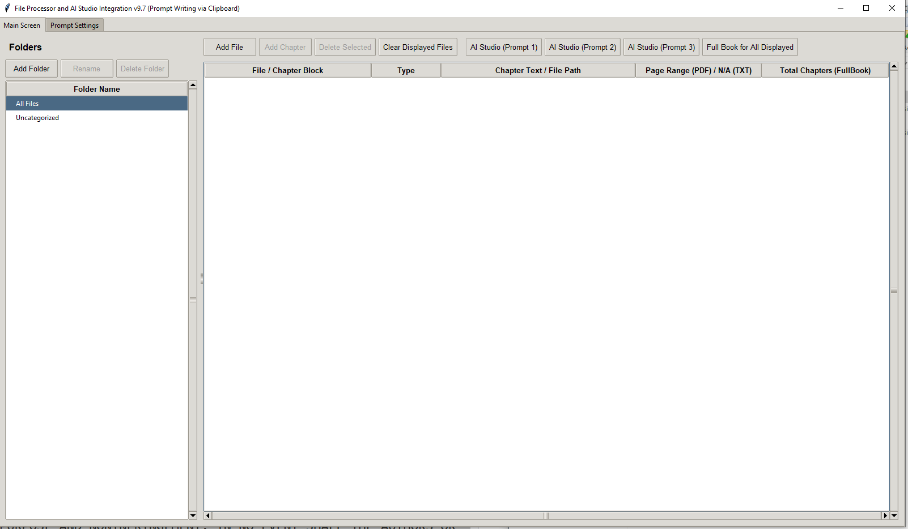
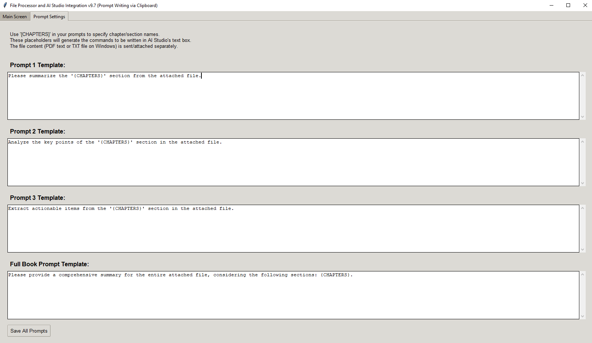

# AI Studio Automator

A desktop application built with Python and Tkinter to streamline the process of analyzing and summarizing documents using Google's AI Studio. This tool allows you to manage a library of PDF and TXT files, define specific sections or "chapters," and then automatically process them in AI Studio using customizable prompt templates.

## Key Features

- **File & Folder Management**: Organize your PDF and TXT files into custom folders directly within the application.
- **Chapter Definition**: For each file, define multiple "Chapter Blocks." For PDFs, you can specify complex page ranges (e.g., `1-5, 8, 12-15`) for each chapter.
- **AI Studio Automation**: Uses `pyautogui` to automatically open AI Studio, paste content, and submit prompts, opening each request in a new browser tab.
- **Customizable Prompt Templates**: Create and save multiple prompt templates. Use the `{CHAPTERS}` placeholder to dynamically insert chapter names into your prompts.
- **Multiple Processing Modes**:
    - **Single Chapter**: Process a single, specific chapter via the right-click context menu.
    - **Batch Processing**: Process all visible chapters in the list with a single click.
    - **Full Book Mode**: For large documents, specify a total number of "conceptual chapters." The tool will process the entire file in chunks, helping to manage context limits.
- **Smart Clipboard Handling**:
    - For PDFs, it extracts text from the specified pages and combines it with your prompt.
    - For TXT files on Windows, it copies the **file object** directly to the clipboard, allowing AI Studio to ingest it more reliably than pasted text.
- **Persistent State**: Your file list, folders, and prompt templates are automatically saved and reloaded between sessions.
- **User-Friendly Interface**: Features drag-and-drop for adding files, in-place editing of items, and a clear, tabbed layout.

## Screenshots

### Main Interface
The main window displays your folders, files, and chapter blocks. From here, you can add/remove items and initiate batch processing.



### Prompt Configuration
The settings tab allows you to customize and save the prompt templates used for automation.



## Use Cases

- **Academic Research**: Quickly summarize chapters or sections from multiple research papers.
- **Book Analysis**: Break down a book into chapters and generate summaries or analyses for each one.
- **Report Processing**: Batch-process a series of business or technical reports to extract key findings or action items.
- **Prompt Prototyping**: Efficiently test different prompts on various sections of a large document.

## Installation

This application is built with Python 3. You will need to install several external libraries.

1.  **Clone the repository:**
    ```bash
    git clone https://github.com/your-username/ai-studio-automator.git
    cd ai-studio-automator
    ```

2.  **Create a `requirements.txt` file** with the following content:
    ```
    PyPDF2
    tkinterdnd2
    pyautogui
    pyperclip
    # For Windows users, pywin32 is also required for optimal TXT file handling
    pywin32; sys_platform == 'win32'
    ```

3.  **Install the dependencies:**
    ```bash
    pip install -r requirements.txt
    ```

## How to Use

1.  **Run the script:**
    ```bash
    python ai_studio_automator.py
    ```

2.  **Add Files**:
    - Click the **"Add File"** button to open a file dialog.
    - Or, **drag and drop** PDF/TXT files onto the main file list area.

3.  **Organize (Optional)**:
    - Use the **"Add Folder"** button to create categories.
    - Right-click a file and select **"Move to Folder"** to organize your items.

4.  **Define Chapters**:
    - Select a file in the list and click **"Add Chapter"** to create a new chapter block under it.
    - **Double-click** a chapter's text or page range to edit it.
        - **Chapter Text**: A descriptive name for the chapter (e.g., "Introduction", "Chapter 3: Methodology").
        - **Page Range (PDF)**: The specific pages for this chapter (e.g., `5-10`).
        - **Total Chapters (Full Book)**: For the file itself, double-click the "Total Chapters" column to set the number of conceptual chapters for the "Full Book" processing mode.

5.  **Configure Prompts**:
    - Go to the **"Prompt Settings"** tab (see screenshot above).
    - Edit the templates for Prompt 1, 2, 3, and the Full Book prompt. Remember to use `{CHAPTERS}` where you want the chapter name(s) to be inserted.
    - Click **"Save All Prompts"**.

6.  **Run Automation**:
    - **Batch Mode**: Click one of the **"AI Studio (Prompt 1/2/3)"** buttons at the top to process all visible chapters.
    - **Full Book Mode**: Click **"Full Book for All Displayed"** to process all files that have a "Total Chapters" count greater than zero.
    - **Single Item Mode**: **Right-click** on any file or chapter to process it individually with a specific prompt.

### **⚠️ Important Warning**

This tool uses `pyautogui` to control your mouse and keyboard. **Once you start an automation process, do not use your computer's mouse or keyboard until the process is complete.** The application will show a "Completed" message when it's finished. Interrupting the process can lead to unexpected behavior.

## License

This project is licensed under the MIT License. See the `LICENSE` file for details.